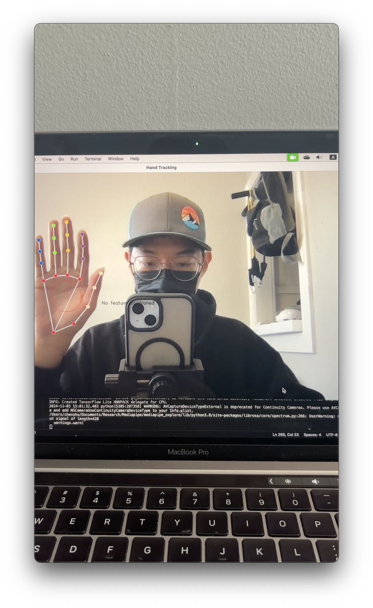
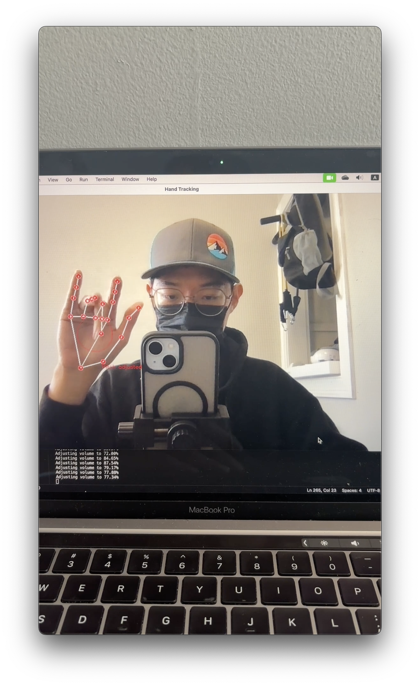
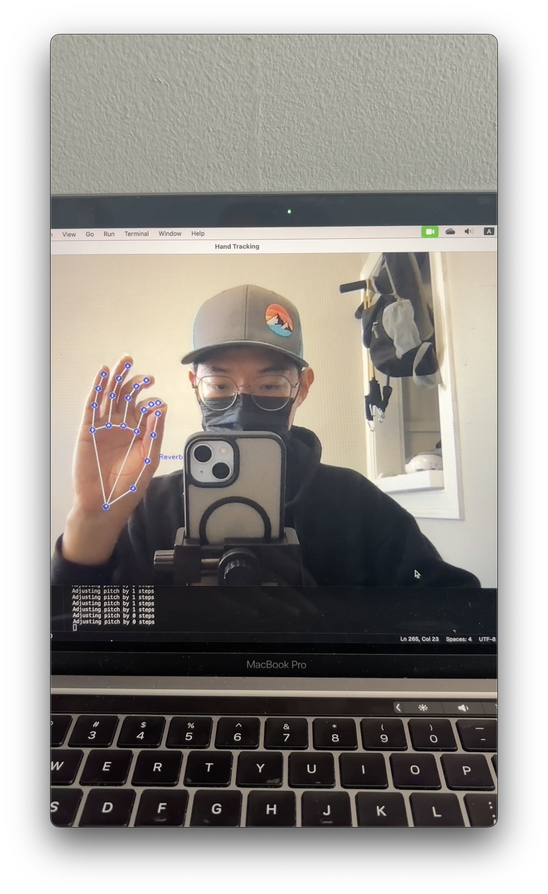

# TangibleMIDI

## TLDR
**TangibleMIDI** uses hand landmarks, captured by Mediapipe, to dynamically control audio data. Breaking the constraint from physical musical instruments.

## Operation
| Ground | Volume | Pitch | Echo |
|:-------:|:-------:|:-------:|:-------:|
|  |  |  |  |
| Thumb touch palm | Index finger touch palm | Middle finger touch palm | Pinch thumb and index finger |
| Rainbow Color | Green | Red | Blue | 